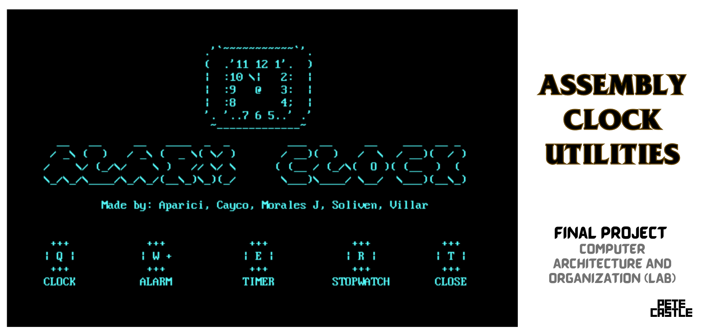
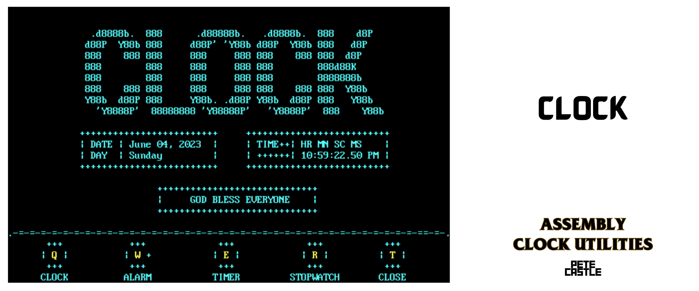
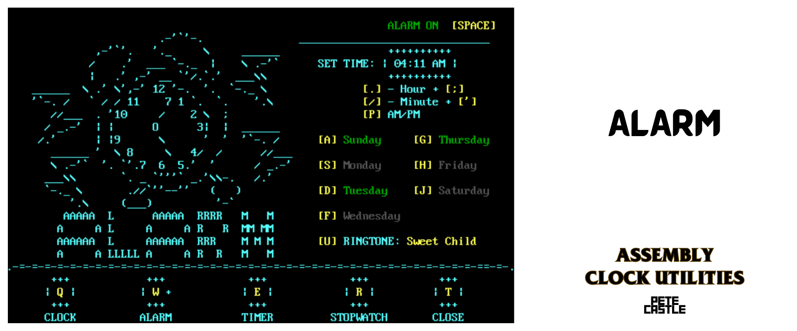
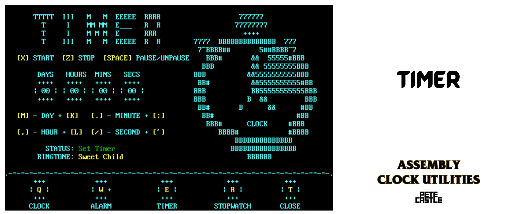
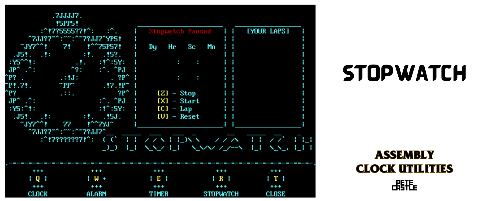

# Assembly Clock Utilities


### Objectives
* 10 interrupts with functions
* Create a clock using assembly language.
* Develop a graphical user interface (GUI) with multiple pages, including a Front/Home Page, Clock, Alarm, Stopwatch, and Timer.
* Implement functionality to display the date and time accurately on the Clock page.
* Enable setting and triggering alarms with 3 ringtones.
* Implement a stopwatch feature with start, stop, lap and reset functionality.
* Create a timer feature that allows users to set a specific duration (from day to second) and trigger an alarm when the time elapses.
* Modify frequencies of sound to create three different ringtones for the alarms.
* Ensure all functionalities are fully functional.

### File Structure
#### Core Files
|     Core   Files     |    Description                                           |
|----------------------|-----------------------------------------------|
|     main.asm         |     Program's   entry point                   |
|     clock.inc        |     All   functionalities of the clock        |
|     swatch.inc       |     All   functionalities of the stopwatch    |
|     timer.inc        |     All   functionalities of the timer        |
|     alarm.inc        |     All   functionalities of the alarm        |

#### Dependencies
|     Dependencies    | Description                                                                                                                                 |
|---------------------|---------------------------------------------------------------------------------------------------------------------------------------------|
|     datetime.inc    |     Provides   date and time information and its associated arithmetic operations.                                                          |
|     hotkeys.inc     |     Data   file for displaying GUI hotkeys.                                                                                                 |
|     notes.inc       |     Procedures   pertaining to different nodes needed for music.                                                                            |
|     sound.inc       |     Procedures   for playing all music available in the program.  Also responsible for determining the   current music.                     |
|     utils.inc       |     Utilities   for improvement of user experience including but not limited to cursor   movement, screen clearing, and string printing.    |
|     math.inc        |     Provides   arithmetic operations for the program.                                                                                       |


### Execution
The program starts in the **Main** function, where it prints the main graphical user interface (GUI) and waits for keyboard input.

If the user enters "Q," the program calls the Clock function. If the user enters "W," the program calls the Alarm function. If the user enters "E," the program calls the Timer function. If the user enters "R," the program calls the Stopwatch function. If the user enters "T," the program terminates. If the user enters any other input, the program loops back to waiting for keyboard input.


The **Clock** function is responsible for displaying the clock GUI, getting keyboard input, and handling menu inputs similar to the Main function. If no input is provided, it retrieves the current date and time and displays it. It then continues to wait for keyboard input.


The **Alarm** function handles alarm functionality. It displays the alarm GUI, gets keyboard input, and handles various inputs such as enabling or disabling the alarm for specific days, setting AM/PM for the alarm, incrementing or decrementing the alarm hour and minute, enabling or disabling the alarm overall, changing the ringtone, and handling menu inputs similar to the Main function. It checks if the alarm is enabled and if it's enabled for the current day. If the alarm time matches the current time, it plays the alarm sound and displays the alarm GUI.


The **Timer** function handles timer functionality. It displays the timer GUI, gets keyboard input, and handles inputs such as setting the timer, starting and stopping the timer, incrementing or decrementing the days, hours, minutes, and seconds of the timer, changing the timer ringtone, and handling menu inputs similar to the Main function. It uses a delay of one second to simulate time passing. If the timer is active and running, it decrements the remaining timer and displays it. If the timer reaches zero, it plays a timer done sound, displays the set timer, and stops the timer.


The **Stopwatch** function handles stopwatch functionality. It displays the stopwatch GUI, gets keyboard input, and handles inputs such as starting and stopping the stopwatch, displaying the previous lap time, resetting the stopwatch and lap counter, clearing laps, and handling menu inputs like the Main function. It uses a delay of one second to simulate time passing. If the stopwatch is running, it increments the stopwatch counter and lap counter, and displays them.

In each function, after the respective actions are performed, the program loops back to waiting for keyboard input, allowing the user to interact with the menu and choose different options.


#### Core Files
`main.asm` - Program's entry point
`clock.inc` - All functionalities of the clock
`alarm.inc` - All functionalities of the alarm
`swatch.inc` - All functionalities of the stopwatch
`timer.inc` - All functionalities of the timer
### Dependencices
`datetime.inc` - Provides date and time information and its associated arithmetic operations.
`hotkeys.inc` - Data file for displaying GUI hotkeys.
`notes.inc` - Procedures pertaining to different nodes needed for musics.
`sound.inc` - Procedures for playing all musics available in the program.  Also responsible for determining the current music.
`utils.inc` - Utilities for improvement of user experience including but not limited to cursor movement, screen clearing, and string printing.
`math.inc` - Provides arithmetic operations for the program.

### List of Interrupts
|     Method                   |     Used   For                                                 |     Details                                                              |     Found   In                                              |
|------------------------------|----------------------------------------------------------------|--------------------------------------------------------------------------|-------------------------------------------------------------|
|     INT   21H / AH = 09H     |     Standard   String Output                                   |     output of a string at DS:DX.   String must be terminated by '$'.     |     Main.asm                                                |
|     INT   10H / AH = 13H     |     Formatted   String output                                  |     Write   String                                                       |     Main.asm,   sound.inc, swatch.inc                       |
|     INT   10H / AH = 01H     |     Enable/Disable   Cursor Display                            |     set text-mode cursor shape.                                          |     Utils.inc                                               |
|     INT 1AH   / AH = 00H     |     Get   system time (tick based)     Delay   (loop based)    |     get system time number of clock ticks since   midnight.              |     Utils.inc                                               |
|     INT   15H / AH = 86H     |     Delay   (seconds based)                                    |     BIOS   wait function                                                 |     Utils.inc                                               |
|     INT   10H / AH = 06H     |     Clear   Screen                                             |     Scroll   Up Window                                                   |     Utils.inc                                               |
|     INT   21H / AH = 08H     |     Get   Keyboard Input (Synchronous; Blocking)               |     Character   Input without Echo                                       |     Utils.inc                                               |
|     INT   16H / AH = 00H     |     Get   Keyboard Input (Asynchronous; Nonblocking)           |     Get   Keystroke from keyboard (no echo)                              |     Utils.inc,   swatch.inc, timer.inc, clock.inc,          |
|     INT   16H / AH = 01H     |                                                                |     Checks   for keystroke in the keyboard buffer                        |                                                             |
|     INT 21H   / AH = 4CH     |     Exit   program                                             |     Return   control to OS                                               |     Utils.inc                                               |
|     INT 10H   / AH = 02H     |     Change   and reset cursor position                         |     Set   cursor position                                                |     Utils.inc                                               |
|     INT   21H / AH = 2Ah     |     Get   System Date                                          |                                                                          |     Datetime.inc                                            |
|     INT   21H / AH = 2Ch     |     Get   System Time                                          |                                                                          |     Datetime.inc                                            |
|     INT   21H / AH = 02H     |     Print   a character                                        |     Write   character to standard output                                 |     Datetime.inc                                            |

### Pseudocode
```
Main()
    PrintMainGui()
    GetKeyboardInput()
    
    //Menu Inputs
    If input = "Q":
        CALL Clock()
    Else if input = "W"
        CALL Alarm()
    Else if input = "E"
        CALL Timer()
    Else if input = "R"
        CALL Stopwatch()
    Else if input = "T"
        TerminateProgram
    Else
        Loop

Clock()
    PrintClockGui()
    GetCurrentDateTime()
    DisplayDateTime()
    GetKeyboardInput()
    
    //Get Menu Inputs similar to Main()
    If no input:
        GetCurrentDateTime()
        DisplayDateTime()

Alarm()
    //Alarm Variables
    AlarmTime : DateTime
    AlarmEnabled : Boolean
    AlarmDays : Bitwise Boolean Array // Bit 0 is Sunday and Bit 6 is Saturday

    PrintAlarmGui()
    GetKeyboardInput()
    If input = "A" or "S" or "D" or ... or "J"
        EnableOrDisableAlarmForDay() // Sunday is A and Saturday is J
    else if input = "P"
        SetAlarmPMorAM()
    else if input = "." or ";"
        IncrementOrDecrementAlarmHour()
    else if input = "," or "/"
        IncrementOrDecrementAlarmMinute()
    else if input is space
        EnableOrDisableAlarm()
    else if input = "U"
        ChangeRingtone()
    else if input is a menu hotkey //Get Menu Inputs similar to Main()
        // Change to Timer, Stopwatch, or Clock

    //Checks if program should alarm
    if not AlarmEnabled
        Loop //To KeyBoard Input
    else if not AlarmEnabledForDay // Checks if current day is True in AlarmDays variable.
        Loop //To KeyBoard Input
    else if AlarmTime = CurrentTime
        PlayAlarmSound()
        DisplayAlarmGui()
        Loop //To KeyBoard Input

Timer()
    SetTimer : DateTime
    RemainingTimer : DateTime
    TimerActive : Boolean // TimerActive is when the user has set a timer is already started
    TimerRunning : Boolean // Timer is running when timer is UNPAUSED and is TimerActive

    PrintTimerGui()
    GetKeyboardInput()
    If input = "X"
        If SetTimer is  0 //Or empty
            Loop //To KeyBoard Input
        Else
            TimerActive = True
            RemainingTimer = SetTimer
    Else If input = "Z"
        TimerActive = 0
        TimerRunning = 0
        RemainingTimer = SetTimer
    Else If input is Space
        TimerRunning = 1 or 0 // Toggles between 1 or 0
    Else If input = "M" or "K"
        IncrementOrDecrementSetTimerDays()
    Else If input = "," or "L"
        IncrementOrDecrementSetTimerHours()
    Else If input = "." or ";"
        IncrementOrDecrementSetTimerMinutes()
    Else If input = "/" or "'"
        IncrementOrDecrementSetTimerSeconds()
    Else If input = "u"
        ChangeTimerRingtone()
    Else If input is a menu hotkey //Get Menu Inputs similar to Main()
        // Change to Alarm, Stopwatch, or Clock
    
    //Ticks Timer
    Delay1Sec()
    If TimerActive and TimerRunning
        If RemainingTimer = 0
            PlayTimerDoneSound()
            DisplaySetTimer()
            TimerActive = 0
            Loop //To KeyBoard Input
        Else
            DecrementRemainingTimer()
            DisplayRemainingTimer()
            Loop //To KeyBoard Input
    Else
        Loop //To KeyBoard Input

Stopwatch()
    StopwatchCounter : DateTime
    LapCounter : DateTime
    StopwatchRunning : Boolean

    PrintStopwatchGui()
    GetKeyboardInput()
    If input = "X"
        StopwatchRunning = 1
    Else If input = "Z"
        StopwatchRunning = 0
    Else If input = "C"
        DisplayPreviousLap()
        LapCounter = 0
    Else If input = "V"
        Stopwatch = 0
        LapCounter = 0
        ClearLaps()
        Stopwatch()
    Else If input is a menu hotkey //Get Menu Inputs similar to Main()
        // Change to Alarm, Timer, or Clock

    //Ticks Stopwatch
    Delay1Sec()
    If StopwatchRunning
        IncrementStopwatchCounter()
        DisplayStopwatchCounter()
        IncrementLapCounter()
        DisplayLapCounter()
        Loop //To KeyBoard Input
    Else
        Loop //To KeyBoard Input
```

